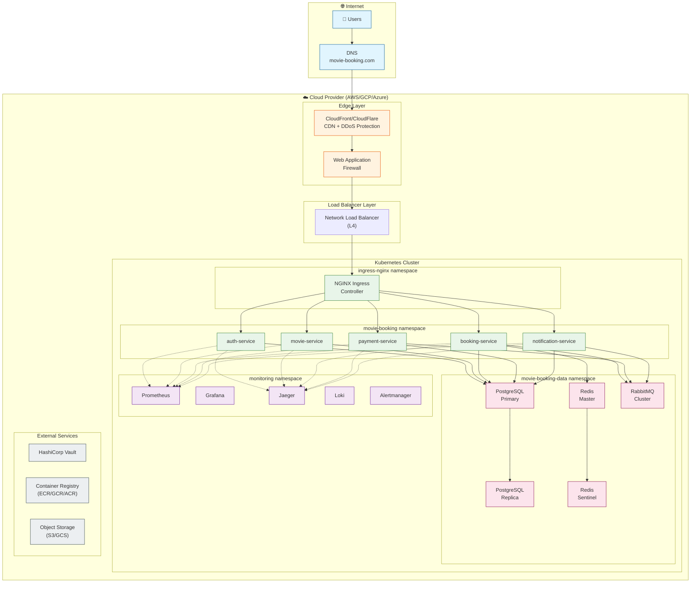
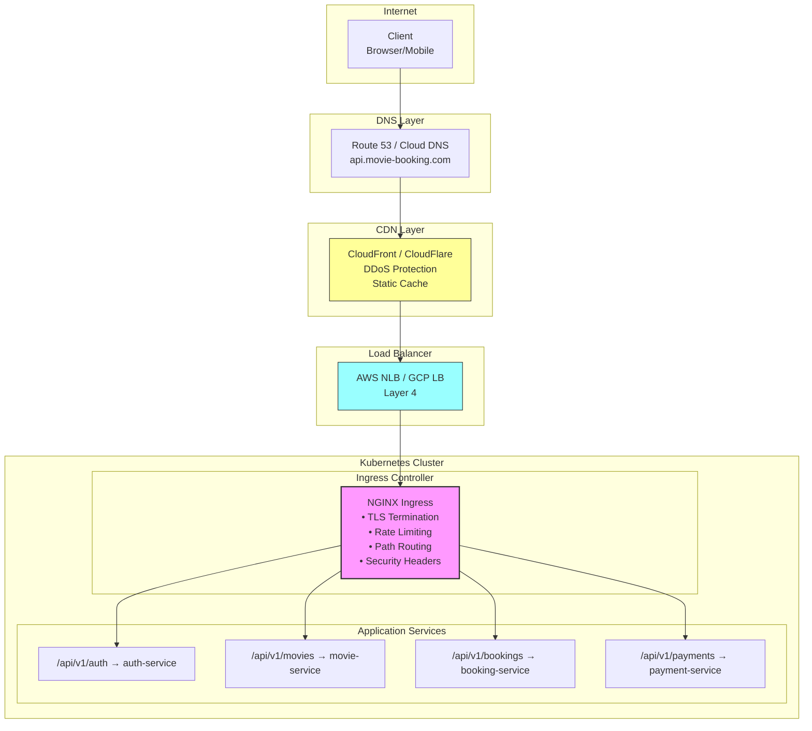
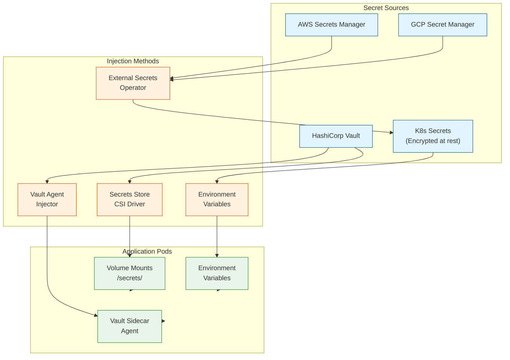
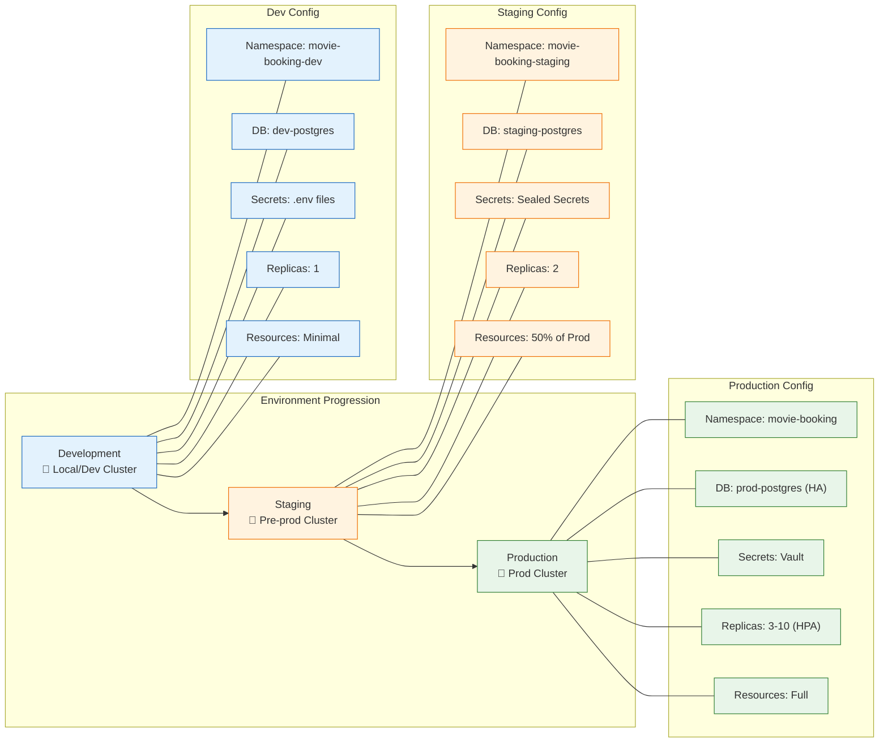
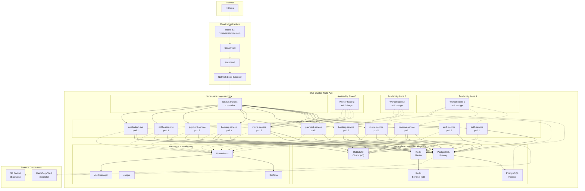
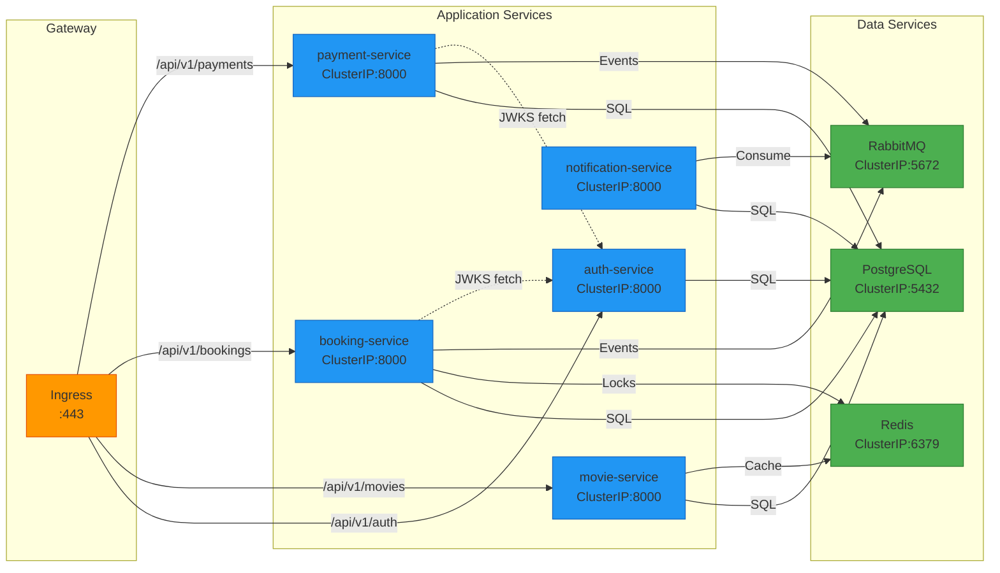
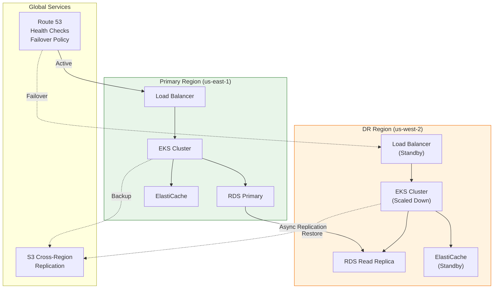

# 🏭 Phase 3: Infrastructure & Delivery
## Movie Booking Distributed System

> **Scope**: Production-ready Kubernetes deployment, CI/CD pipelines, and environment management.  
> **Audience**: DevOps Engineers, Platform Engineers, SREs.

---

## Table of Contents

1. [Infrastructure Overview](#1-infrastructure-overview)
2. [Kubernetes Architecture](#2-kubernetes-architecture)
3. [Ingress Strategy](#3-ingress-strategy)
4. [Autoscaling (HPA/VPA)](#4-autoscaling-hpavpa)
5. [Resource Management](#5-resource-management)
6. [Health Probes](#6-health-probes)
7. [Secrets Management](#7-secrets-management)
8. [CI/CD Pipeline](#8-cicd-pipeline)
9. [Environment Separation](#9-environment-separation)
10. [Deployment Diagrams](#10-deployment-diagrams)
11. [Disaster Recovery](#11-disaster-recovery)

---

## 1. Infrastructure Overview

### 1.1 High-Level Deployment Topology



### 1.2 Technology Stack

| Layer | Technology | Purpose |
|-------|------------|---------|
| **Container Orchestration** | Kubernetes 1.28+ | Workload management |
| **Ingress** | NGINX Ingress Controller | L7 routing, TLS termination |
| **Service Mesh** | (Optional) Istio / Linkerd | mTLS, observability |
| **Container Runtime** | containerd | OCI runtime |
| **CNI** | Calico / Cilium | Network policies |
| **Storage** | AWS EBS / GCE PD | Persistent volumes |
| **Secrets** | HashiCorp Vault / K8s Secrets | Secret management |
| **CI/CD** | GitHub Actions / GitLab CI | Pipeline automation |
| **Registry** | AWS ECR / GCR / Harbor | Container images |

---

## 2. Kubernetes Architecture

### 2.1 Namespace Strategy

```yaml
# Namespace definitions
apiVersion: v1
kind: Namespace
metadata:
  name: movie-booking
  labels:
    app.kubernetes.io/part-of: movie-booking
    environment: production
---
apiVersion: v1
kind: Namespace
metadata:
  name: movie-booking-data
  labels:
    app.kubernetes.io/part-of: movie-booking
    tier: data
---
apiVersion: v1
kind: Namespace
metadata:
  name: monitoring
  labels:
    app.kubernetes.io/part-of: movie-booking
    tier: observability
```

### 2.2 Namespace Isolation

```
┌─────────────────────────────────────────────────────────────────────────────┐
│                         NAMESPACE ARCHITECTURE                              │
├─────────────────────────────────────────────────────────────────────────────┤
│                                                                             │
│  ┌─────────────────────────────────────────────────────────────────────┐   │
│  │  ingress-nginx (System Namespace)                                    │   │
│  │  ├── nginx-ingress-controller (DaemonSet or Deployment)             │   │
│  │  └── default-backend                                                 │   │
│  └─────────────────────────────────────────────────────────────────────┘   │
│                                    │                                        │
│                                    ▼ (Network Policy: ingress allowed)      │
│  ┌─────────────────────────────────────────────────────────────────────┐   │
│  │  movie-booking (Application Namespace)                               │   │
│  │  ├── auth-service (Deployment, 2-5 replicas)                        │   │
│  │  ├── movie-service (Deployment, 2-5 replicas)                       │   │
│  │  ├── booking-service (Deployment, 3-10 replicas)                    │   │
│  │  ├── payment-service (Deployment, 2-8 replicas)                     │   │
│  │  ├── notification-service (Deployment, 2-5 replicas)                │   │
│  │  ├── ConfigMaps (service configs)                                   │   │
│  │  └── ServiceAccounts (per-service RBAC)                             │   │
│  └─────────────────────────────────────────────────────────────────────┘   │
│                                    │                                        │
│                                    ▼ (Network Policy: data access)          │
│  ┌─────────────────────────────────────────────────────────────────────┐   │
│  │  movie-booking-data (Data Namespace)                                 │   │
│  │  ├── postgresql (StatefulSet, 1 primary + N replicas)               │   │
│  │  ├── redis-sentinel (StatefulSet, 3 nodes)                          │   │
│  │  ├── rabbitmq (StatefulSet, 3-node cluster)                         │   │
│  │  ├── PersistentVolumeClaims                                         │   │
│  │  └── Secrets (database credentials)                                 │   │
│  └─────────────────────────────────────────────────────────────────────┘   │
│                                    │                                        │
│                                    ▼ (Network Policy: metrics scrape)       │
│  ┌─────────────────────────────────────────────────────────────────────┐   │
│  │  monitoring (Observability Namespace)                                │   │
│  │  ├── prometheus (StatefulSet)                                       │   │
│  │  ├── grafana (Deployment)                                           │   │
│  │  ├── jaeger (Deployment + Collector)                                │   │
│  │  ├── loki (StatefulSet)                                             │   │
│  │  ├── alertmanager (Deployment)                                      │   │
│  │  └── kube-state-metrics (DaemonSet)                                 │   │
│  └─────────────────────────────────────────────────────────────────────┘   │
│                                                                             │
└─────────────────────────────────────────────────────────────────────────────┘
```

### 2.3 Service Deployment Manifest

```yaml
# kubernetes/base/booking-service/deployment.yaml
apiVersion: apps/v1
kind: Deployment
metadata:
  name: booking-service
  namespace: movie-booking
  labels:
    app: booking-service
    app.kubernetes.io/name: booking-service
    app.kubernetes.io/component: backend
    app.kubernetes.io/part-of: movie-booking
    app.kubernetes.io/version: "1.0.0"
spec:
  replicas: 3
  revisionHistoryLimit: 5
  strategy:
    type: RollingUpdate
    rollingUpdate:
      maxSurge: 1
      maxUnavailable: 0
  selector:
    matchLabels:
      app: booking-service
  template:
    metadata:
      labels:
        app: booking-service
        app.kubernetes.io/name: booking-service
      annotations:
        prometheus.io/scrape: "true"
        prometheus.io/port: "8000"
        prometheus.io/path: "/metrics"
    spec:
      serviceAccountName: booking-service
      securityContext:
        runAsNonRoot: true
        runAsUser: 1000
        fsGroup: 1000
      
      # Anti-affinity: spread across nodes
      affinity:
        podAntiAffinity:
          preferredDuringSchedulingIgnoredDuringExecution:
            - weight: 100
              podAffinityTerm:
                labelSelector:
                  matchLabels:
                    app: booking-service
                topologyKey: kubernetes.io/hostname
      
      # Topology spread for zone distribution
      topologySpreadConstraints:
        - maxSkew: 1
          topologyKey: topology.kubernetes.io/zone
          whenUnsatisfiable: ScheduleAnyway
          labelSelector:
            matchLabels:
              app: booking-service
      
      containers:
        - name: booking-service
          image: ${REGISTRY}/booking-service:${VERSION}
          imagePullPolicy: IfNotPresent
          
          ports:
            - name: http
              containerPort: 8000
              protocol: TCP
          
          env:
            - name: SERVICE_NAME
              value: "booking-service"
            - name: ENVIRONMENT
              valueFrom:
                configMapKeyRef:
                  name: booking-service-config
                  key: ENVIRONMENT
            - name: DATABASE_URL
              valueFrom:
                secretKeyRef:
                  name: booking-service-secrets
                  key: DATABASE_URL
            - name: REDIS_URL
              valueFrom:
                secretKeyRef:
                  name: booking-service-secrets
                  key: REDIS_URL
            - name: RABBITMQ_URL
              valueFrom:
                secretKeyRef:
                  name: booking-service-secrets
                  key: RABBITMQ_URL
            - name: AUTH_SERVICE_URL
              value: "http://auth-service:8000"
            - name: MOVIE_SERVICE_URL
              value: "http://movie-service:8000"
            - name: JAEGER_ENDPOINT
              value: "http://jaeger-collector.monitoring:4317"
          
          # Resource management
          resources:
            requests:
              cpu: 200m
              memory: 512Mi
            limits:
              cpu: 1000m
              memory: 1Gi
          
          # Health probes
          startupProbe:
            httpGet:
              path: /health
              port: http
            initialDelaySeconds: 10
            periodSeconds: 5
            failureThreshold: 30
          
          livenessProbe:
            httpGet:
              path: /health
              port: http
            initialDelaySeconds: 0
            periodSeconds: 10
            timeoutSeconds: 5
            failureThreshold: 3
          
          readinessProbe:
            httpGet:
              path: /health/ready
              port: http
            initialDelaySeconds: 0
            periodSeconds: 5
            timeoutSeconds: 3
            failureThreshold: 3
          
          # Security context
          securityContext:
            allowPrivilegeEscalation: false
            readOnlyRootFilesystem: true
            capabilities:
              drop:
                - ALL
          
          # Graceful shutdown
          lifecycle:
            preStop:
              exec:
                command: ["/bin/sh", "-c", "sleep 15"]
          
          volumeMounts:
            - name: tmp
              mountPath: /tmp
            - name: cache
              mountPath: /app/.cache
      
      volumes:
        - name: tmp
          emptyDir: {}
        - name: cache
          emptyDir: {}
      
      terminationGracePeriodSeconds: 30
      
      imagePullSecrets:
        - name: registry-credentials

---
# Service definition
apiVersion: v1
kind: Service
metadata:
  name: booking-service
  namespace: movie-booking
  labels:
    app: booking-service
spec:
  type: ClusterIP
  ports:
    - name: http
      port: 8000
      targetPort: http
      protocol: TCP
  selector:
    app: booking-service

---
# Pod Disruption Budget
apiVersion: policy/v1
kind: PodDisruptionBudget
metadata:
  name: booking-service-pdb
  namespace: movie-booking
spec:
  minAvailable: 2
  selector:
    matchLabels:
      app: booking-service
```

### 2.4 StatefulSet for Data Services

```yaml
# kubernetes/base/data/postgresql.yaml
apiVersion: apps/v1
kind: StatefulSet
metadata:
  name: postgresql
  namespace: movie-booking-data
spec:
  serviceName: postgresql
  replicas: 2  # 1 primary + 1 replica
  selector:
    matchLabels:
      app: postgresql
  template:
    metadata:
      labels:
        app: postgresql
    spec:
      securityContext:
        runAsNonRoot: true
        fsGroup: 999
      
      containers:
        - name: postgresql
          image: postgres:15-alpine
          ports:
            - containerPort: 5432
              name: postgresql
          
          env:
            - name: POSTGRES_DB
              value: movie_booking
            - name: POSTGRES_USER
              valueFrom:
                secretKeyRef:
                  name: postgresql-credentials
                  key: username
            - name: POSTGRES_PASSWORD
              valueFrom:
                secretKeyRef:
                  name: postgresql-credentials
                  key: password
            - name: PGDATA
              value: /var/lib/postgresql/data/pgdata
          
          resources:
            requests:
              cpu: 500m
              memory: 1Gi
            limits:
              cpu: 2000m
              memory: 4Gi
          
          volumeMounts:
            - name: data
              mountPath: /var/lib/postgresql/data
          
          livenessProbe:
            exec:
              command:
                - /bin/sh
                - -c
                - pg_isready -U $POSTGRES_USER -d $POSTGRES_DB
            initialDelaySeconds: 30
            periodSeconds: 10
          
          readinessProbe:
            exec:
              command:
                - /bin/sh
                - -c
                - pg_isready -U $POSTGRES_USER -d $POSTGRES_DB
            initialDelaySeconds: 5
            periodSeconds: 5
  
  volumeClaimTemplates:
    - metadata:
        name: data
      spec:
        accessModes: ["ReadWriteOnce"]
        storageClassName: fast-ssd
        resources:
          requests:
            storage: 100Gi
```

### 2.5 Network Policies

```yaml
# kubernetes/base/network-policies/app-network-policy.yaml
apiVersion: networking.k8s.io/v1
kind: NetworkPolicy
metadata:
  name: booking-service-network-policy
  namespace: movie-booking
spec:
  podSelector:
    matchLabels:
      app: booking-service
  policyTypes:
    - Ingress
    - Egress
  
  ingress:
    # Allow from ingress controller
    - from:
        - namespaceSelector:
            matchLabels:
              name: ingress-nginx
          podSelector:
            matchLabels:
              app.kubernetes.io/name: ingress-nginx
      ports:
        - protocol: TCP
          port: 8000
    
    # Allow from other services in same namespace
    - from:
        - namespaceSelector:
            matchLabels:
              app.kubernetes.io/part-of: movie-booking
      ports:
        - protocol: TCP
          port: 8000
    
    # Allow Prometheus scraping
    - from:
        - namespaceSelector:
            matchLabels:
              name: monitoring
          podSelector:
            matchLabels:
              app: prometheus
      ports:
        - protocol: TCP
          port: 8000
  
  egress:
    # Allow DNS
    - to:
        - namespaceSelector: {}
          podSelector:
            matchLabels:
              k8s-app: kube-dns
      ports:
        - protocol: UDP
          port: 53
    
    # Allow to PostgreSQL
    - to:
        - namespaceSelector:
            matchLabels:
              name: movie-booking-data
          podSelector:
            matchLabels:
              app: postgresql
      ports:
        - protocol: TCP
          port: 5432
    
    # Allow to Redis
    - to:
        - namespaceSelector:
            matchLabels:
              name: movie-booking-data
          podSelector:
            matchLabels:
              app: redis
      ports:
        - protocol: TCP
          port: 6379
    
    # Allow to RabbitMQ
    - to:
        - namespaceSelector:
            matchLabels:
              name: movie-booking-data
          podSelector:
            matchLabels:
              app: rabbitmq
      ports:
        - protocol: TCP
          port: 5672
    
    # Allow to other services
    - to:
        - namespaceSelector:
            matchLabels:
              app.kubernetes.io/part-of: movie-booking
      ports:
        - protocol: TCP
          port: 8000
    
    # Allow to Jaeger
    - to:
        - namespaceSelector:
            matchLabels:
              name: monitoring
          podSelector:
            matchLabels:
              app: jaeger
      ports:
        - protocol: TCP
          port: 4317
```

---

## 3. Ingress Strategy

### 3.1 NGINX Ingress Controller

```yaml
# kubernetes/base/ingress/ingress.yaml
apiVersion: networking.k8s.io/v1
kind: Ingress
metadata:
  name: movie-booking-ingress
  namespace: movie-booking
  annotations:
    # Ingress class
    kubernetes.io/ingress.class: nginx
    
    # TLS configuration
    cert-manager.io/cluster-issuer: letsencrypt-prod
    nginx.ingress.kubernetes.io/ssl-redirect: "true"
    nginx.ingress.kubernetes.io/force-ssl-redirect: "true"
    
    # Rate limiting
    nginx.ingress.kubernetes.io/limit-rps: "100"
    nginx.ingress.kubernetes.io/limit-connections: "50"
    
    # Timeouts
    nginx.ingress.kubernetes.io/proxy-connect-timeout: "10"
    nginx.ingress.kubernetes.io/proxy-read-timeout: "60"
    nginx.ingress.kubernetes.io/proxy-send-timeout: "60"
    
    # Request size
    nginx.ingress.kubernetes.io/proxy-body-size: "10m"
    
    # CORS (if needed)
    nginx.ingress.kubernetes.io/enable-cors: "true"
    nginx.ingress.kubernetes.io/cors-allow-origin: "https://movie-booking.com"
    nginx.ingress.kubernetes.io/cors-allow-methods: "GET, POST, PUT, DELETE, OPTIONS"
    nginx.ingress.kubernetes.io/cors-allow-headers: "DNT,User-Agent,X-Requested-With,If-Modified-Since,Cache-Control,Content-Type,Range,Authorization,X-Correlation-ID"
    
    # Security headers
    nginx.ingress.kubernetes.io/configuration-snippet: |
      add_header X-Frame-Options "SAMEORIGIN" always;
      add_header X-Content-Type-Options "nosniff" always;
      add_header X-XSS-Protection "1; mode=block" always;
      add_header Referrer-Policy "strict-origin-when-cross-origin" always;
      add_header Content-Security-Policy "default-src 'self'; script-src 'self' 'unsafe-inline'; style-src 'self' 'unsafe-inline';" always;
spec:
  ingressClassName: nginx
  
  tls:
    - hosts:
        - api.movie-booking.com
      secretName: movie-booking-tls
  
  rules:
    - host: api.movie-booking.com
      http:
        paths:
          # Auth Service
          - path: /api/v1/auth
            pathType: Prefix
            backend:
              service:
                name: auth-service
                port:
                  number: 8000
          
          # Movie Service
          - path: /api/v1/movies
            pathType: Prefix
            backend:
              service:
                name: movie-service
                port:
                  number: 8000
          
          - path: /api/v1/theaters
            pathType: Prefix
            backend:
              service:
                name: movie-service
                port:
                  number: 8000
          
          - path: /api/v1/showtimes
            pathType: Prefix
            backend:
              service:
                name: movie-service
                port:
                  number: 8000
          
          # Booking Service
          - path: /api/v1/bookings
            pathType: Prefix
            backend:
              service:
                name: booking-service
                port:
                  number: 8000
          
          # Payment Service
          - path: /api/v1/payments
            pathType: Prefix
            backend:
              service:
                name: payment-service
                port:
                  number: 8000
          
          # Notification Service (internal only - no external ingress)
          # Health check endpoint (for load balancer)
          - path: /health
            pathType: Exact
            backend:
              service:
                name: auth-service
                port:
                  number: 8000
```

### 3.2 Ingress Architecture Diagram



### 3.3 Rate Limiting Configuration

```yaml
# Per-endpoint rate limiting with annotations
# kubernetes/overlays/production/ingress-patch.yaml
apiVersion: networking.k8s.io/v1
kind: Ingress
metadata:
  name: movie-booking-ingress
  annotations:
    # Global rate limit
    nginx.ingress.kubernetes.io/limit-rps: "100"
    
    # Per-path rate limits using server-snippet
    nginx.ingress.kubernetes.io/server-snippet: |
      # Auth endpoints - higher limit for login
      location ~ ^/api/v1/auth/token {
        limit_req zone=auth_zone burst=20 nodelay;
        limit_req_status 429;
      }
      
      # Booking endpoints - moderate limit
      location ~ ^/api/v1/bookings {
        limit_req zone=booking_zone burst=10 nodelay;
        limit_req_status 429;
      }
      
      # Payment endpoints - strict limit
      location ~ ^/api/v1/payments {
        limit_req zone=payment_zone burst=5 nodelay;
        limit_req_status 429;
      }
```

---

## 4. Autoscaling (HPA/VPA)

### 4.1 Horizontal Pod Autoscaler

```yaml
# kubernetes/base/booking-service/hpa.yaml
apiVersion: autoscaling/v2
kind: HorizontalPodAutoscaler
metadata:
  name: booking-service-hpa
  namespace: movie-booking
spec:
  scaleTargetRef:
    apiVersion: apps/v1
    kind: Deployment
    name: booking-service
  
  minReplicas: 3
  maxReplicas: 10
  
  metrics:
    # CPU-based scaling
    - type: Resource
      resource:
        name: cpu
        target:
          type: Utilization
          averageUtilization: 70
    
    # Memory-based scaling
    - type: Resource
      resource:
        name: memory
        target:
          type: Utilization
          averageUtilization: 80
    
    # Custom metric: requests per second
    - type: Pods
      pods:
        metric:
          name: http_requests_per_second
        target:
          type: AverageValue
          averageValue: "1000"
    
    # Custom metric: queue depth (for booking service)
    - type: External
      external:
        metric:
          name: rabbitmq_queue_messages
          selector:
            matchLabels:
              queue: booking_events
        target:
          type: AverageValue
          averageValue: "100"
  
  behavior:
    scaleDown:
      stabilizationWindowSeconds: 300  # 5 minutes
      policies:
        - type: Percent
          value: 10
          periodSeconds: 60
        - type: Pods
          value: 1
          periodSeconds: 60
      selectPolicy: Min
    
    scaleUp:
      stabilizationWindowSeconds: 0  # Immediate
      policies:
        - type: Percent
          value: 100
          periodSeconds: 15
        - type: Pods
          value: 4
          periodSeconds: 15
      selectPolicy: Max
```

### 4.2 HPA Configuration Matrix

```
┌─────────────────────────────────────────────────────────────────────────────┐
│                         HPA CONFIGURATION MATRIX                            │
├─────────────────────────────────────────────────────────────────────────────┤
│                                                                             │
│  Service            │ Min │ Max │ CPU Target │ Memory │ Custom Metric      │
│  ───────────────────┼─────┼─────┼────────────┼────────┼────────────────────│
│  auth-service       │  2  │  5  │    70%     │  80%   │ login_rate         │
│  movie-service      │  2  │  5  │    70%     │  80%   │ cache_miss_rate    │
│  booking-service    │  3  │ 10  │    70%     │  80%   │ queue_depth        │
│  payment-service    │  2  │  8  │    70%     │  80%   │ transaction_rate   │
│  notification-svc   │  2  │  5  │    70%     │  80%   │ queue_depth        │
│                                                                             │
│  Scale Up Behavior:                                                         │
│  ├── Stabilization: 0s (immediate)                                         │
│  ├── Policy: +100% or +4 pods per 15s (whichever is larger)               │
│  └── Select: Max (aggressive scaling)                                       │
│                                                                             │
│  Scale Down Behavior:                                                       │
│  ├── Stabilization: 300s (5 min cooldown)                                  │
│  ├── Policy: -10% or -1 pod per 60s (whichever is smaller)                │
│  └── Select: Min (conservative scaling)                                     │
│                                                                             │
└─────────────────────────────────────────────────────────────────────────────┘
```

### 4.3 Vertical Pod Autoscaler (Optional)

```yaml
# kubernetes/base/booking-service/vpa.yaml
apiVersion: autoscaling.k8s.io/v1
kind: VerticalPodAutoscaler
metadata:
  name: booking-service-vpa
  namespace: movie-booking
spec:
  targetRef:
    apiVersion: apps/v1
    kind: Deployment
    name: booking-service
  
  updatePolicy:
    updateMode: "Auto"  # Can be "Off", "Initial", "Auto"
  
  resourcePolicy:
    containerPolicies:
      - containerName: booking-service
        minAllowed:
          cpu: 100m
          memory: 256Mi
        maxAllowed:
          cpu: 2000m
          memory: 2Gi
        controlledResources: ["cpu", "memory"]
        controlledValues: RequestsAndLimits
```

---

## 5. Resource Management

### 5.1 Resource Quotas

```yaml
# kubernetes/base/resource-quota.yaml
apiVersion: v1
kind: ResourceQuota
metadata:
  name: movie-booking-quota
  namespace: movie-booking
spec:
  hard:
    # Compute resources
    requests.cpu: "20"
    requests.memory: 40Gi
    limits.cpu: "40"
    limits.memory: 80Gi
    
    # Object counts
    pods: "50"
    services: "20"
    secrets: "50"
    configmaps: "50"
    persistentvolumeclaims: "10"
    
    # Replication controllers
    replicationcontrollers: "0"  # Deprecated, use Deployments
    
---
# Limit Range for defaults
apiVersion: v1
kind: LimitRange
metadata:
  name: movie-booking-limits
  namespace: movie-booking
spec:
  limits:
    # Default limits for containers
    - type: Container
      default:
        cpu: 500m
        memory: 512Mi
      defaultRequest:
        cpu: 100m
        memory: 256Mi
      min:
        cpu: 50m
        memory: 64Mi
      max:
        cpu: 2000m
        memory: 4Gi
    
    # Pod-level limits
    - type: Pod
      max:
        cpu: 4000m
        memory: 8Gi
    
    # PVC limits
    - type: PersistentVolumeClaim
      min:
        storage: 1Gi
      max:
        storage: 100Gi
```

### 5.2 Resource Allocation Strategy

```
┌─────────────────────────────────────────────────────────────────────────────┐
│                      RESOURCE ALLOCATION STRATEGY                           │
├─────────────────────────────────────────────────────────────────────────────┤
│                                                                             │
│  Service             │ Requests         │ Limits           │ QoS Class     │
│  ────────────────────┼──────────────────┼──────────────────┼───────────────│
│  auth-service        │ 100m / 256Mi     │ 500m / 512Mi     │ Burstable     │
│  movie-service       │ 100m / 256Mi     │ 500m / 512Mi     │ Burstable     │
│  booking-service     │ 200m / 512Mi     │ 1000m / 1Gi      │ Burstable     │
│  payment-service     │ 200m / 512Mi     │ 1000m / 1Gi      │ Burstable     │
│  notification-svc    │ 100m / 256Mi     │ 500m / 512Mi     │ Burstable     │
│                                                                             │
│  Data Services (StatefulSet):                                               │
│  ────────────────────┼──────────────────┼──────────────────┼───────────────│
│  postgresql          │ 500m / 1Gi       │ 2000m / 4Gi      │ Burstable     │
│  redis-sentinel      │ 200m / 512Mi     │ 1000m / 1Gi      │ Burstable     │
│  rabbitmq            │ 500m / 1Gi       │ 2000m / 2Gi      │ Burstable     │
│                                                                             │
│  QoS Classes:                                                               │
│  ├── Guaranteed: requests == limits (highest priority)                     │
│  ├── Burstable: requests < limits (medium priority)                        │
│  └── BestEffort: no requests/limits (lowest priority, evicted first)       │
│                                                                             │
│  Recommendation:                                                            │
│  ├── Use Burstable for application services                                │
│  ├── Use Guaranteed for critical data services (optional)                  │
│  └── Avoid BestEffort in production                                        │
│                                                                             │
└─────────────────────────────────────────────────────────────────────────────┘
```

### 5.3 Priority Classes

```yaml
# kubernetes/base/priority-classes.yaml
apiVersion: scheduling.k8s.io/v1
kind: PriorityClass
metadata:
  name: critical-service
value: 1000000
globalDefault: false
description: "Critical services that should never be preempted"
---
apiVersion: scheduling.k8s.io/v1
kind: PriorityClass
metadata:
  name: high-priority
value: 100000
globalDefault: false
description: "Important services (payment, booking)"
---
apiVersion: scheduling.k8s.io/v1
kind: PriorityClass
metadata:
  name: default-priority
value: 10000
globalDefault: true
description: "Default priority for most services"
---
apiVersion: scheduling.k8s.io/v1
kind: PriorityClass
metadata:
  name: low-priority
value: 1000
globalDefault: false
description: "Low priority batch jobs"
```

---

## 6. Health Probes

### 6.1 Probe Configuration Strategy

```
┌─────────────────────────────────────────────────────────────────────────────┐
│                         HEALTH PROBE STRATEGY                               │
├─────────────────────────────────────────────────────────────────────────────┤
│                                                                             │
│  Probe Type     │ Purpose                │ Failure Action                  │
│  ───────────────┼────────────────────────┼─────────────────────────────────│
│  startupProbe   │ Slow-starting apps     │ Delays liveness/readiness      │
│  livenessProbe  │ Detect deadlocks       │ Restart container              │
│  readinessProbe │ Traffic readiness      │ Remove from service endpoints  │
│                                                                             │
│  Configuration Guidelines:                                                  │
│                                                                             │
│  startupProbe:                                                              │
│  ├── initialDelaySeconds: 10  (wait for app to start)                      │
│  ├── periodSeconds: 5                                                       │
│  ├── failureThreshold: 30     (allows up to 150s startup time)             │
│  └── Use for: Apps with slow initialization (DB migrations, cache warm)    │
│                                                                             │
│  livenessProbe:                                                             │
│  ├── initialDelaySeconds: 0   (starts after startupProbe succeeds)         │
│  ├── periodSeconds: 10                                                      │
│  ├── timeoutSeconds: 5                                                      │
│  ├── failureThreshold: 3      (restart after 3 consecutive failures)       │
│  └── Check: Basic health (can process requests, not deadlocked)            │
│                                                                             │
│  readinessProbe:                                                            │
│  ├── initialDelaySeconds: 0                                                │
│  ├── periodSeconds: 5         (faster than liveness)                       │
│  ├── timeoutSeconds: 3                                                      │
│  ├── failureThreshold: 3                                                    │
│  └── Check: Deep health (DB connected, dependencies available)             │
│                                                                             │
└─────────────────────────────────────────────────────────────────────────────┘
```

### 6.2 Health Check Endpoints

```python
# app/api/routes/health.py
from fastapi import APIRouter, Depends
from sqlalchemy.ext.asyncio import AsyncSession
from app.infrastructure.database.connection import get_session
from app.infrastructure.cache.redis_client import get_redis
from app.config import get_settings

router = APIRouter(tags=["Health"])
settings = get_settings()


@router.get("/health")
async def liveness():
    """
    Liveness probe - basic health check.
    
    Returns 200 if the application process is running.
    Does NOT check dependencies (to avoid cascading failures).
    """
    return {
        "status": "healthy",
        "service": settings.service_name,
    }


@router.get("/health/ready")
async def readiness(
    db: AsyncSession = Depends(get_session),
    redis = Depends(get_redis),
):
    """
    Readiness probe - deep health check.
    
    Returns 200 only if all dependencies are accessible.
    Used to determine if pod should receive traffic.
    """
    checks = {}
    all_healthy = True
    
    # Check database
    try:
        await db.execute("SELECT 1")
        checks["database"] = "healthy"
    except Exception as e:
        checks["database"] = f"unhealthy: {str(e)[:50]}"
        all_healthy = False
    
    # Check Redis
    try:
        await redis.ping()
        checks["redis"] = "healthy"
    except Exception as e:
        checks["redis"] = f"unhealthy: {str(e)[:50]}"
        all_healthy = False
    
    # Check RabbitMQ (if applicable)
    if hasattr(settings, 'rabbitmq_url'):
        try:
            # Simplified check - connection pool status
            checks["rabbitmq"] = "healthy"
        except Exception as e:
            checks["rabbitmq"] = f"unhealthy: {str(e)[:50]}"
            all_healthy = False
    
    status_code = 200 if all_healthy else 503
    
    return {
        "status": "ready" if all_healthy else "not_ready",
        "service": settings.service_name,
        "checks": checks,
    }


@router.get("/health/startup")
async def startup():
    """
    Startup probe - initialization check.
    
    Returns 200 once the application has finished starting up.
    Can include one-time initialization checks.
    """
    return {
        "status": "started",
        "service": settings.service_name,
    }
```

### 6.3 Probe YAML Configuration

```yaml
# Full probe configuration example
containers:
  - name: booking-service
    # ...
    
    # Startup probe - allows slow starts
    startupProbe:
      httpGet:
        path: /health/startup
        port: 8000
      initialDelaySeconds: 10
      periodSeconds: 5
      timeoutSeconds: 5
      successThreshold: 1
      failureThreshold: 30  # 30 * 5s = 150s max startup time
    
    # Liveness probe - restart if unhealthy
    livenessProbe:
      httpGet:
        path: /health
        port: 8000
        httpHeaders:
          - name: X-Health-Check
            value: "liveness"
      initialDelaySeconds: 0
      periodSeconds: 10
      timeoutSeconds: 5
      successThreshold: 1
      failureThreshold: 3
    
    # Readiness probe - remove from LB if not ready
    readinessProbe:
      httpGet:
        path: /health/ready
        port: 8000
        httpHeaders:
          - name: X-Health-Check
            value: "readiness"
      initialDelaySeconds: 0
      periodSeconds: 5
      timeoutSeconds: 3
      successThreshold: 1
      failureThreshold: 3
```

---

## 7. Secrets Management

### 7.1 Secret Management Architecture



### 7.2 External Secrets Operator Configuration

```yaml
# kubernetes/base/secrets/external-secret.yaml
apiVersion: external-secrets.io/v1beta1
kind: ExternalSecret
metadata:
  name: booking-service-secrets
  namespace: movie-booking
spec:
  refreshInterval: 1h
  
  secretStoreRef:
    kind: ClusterSecretStore
    name: vault-backend
  
  target:
    name: booking-service-secrets
    creationPolicy: Owner
    template:
      type: Opaque
      data:
        DATABASE_URL: "postgresql+asyncpg://{{ .db_user }}:{{ .db_password }}@postgresql.movie-booking-data:5432/bookings_db"
        REDIS_URL: "redis://:{{ .redis_password }}@redis-sentinel.movie-booking-data:26379/0"
        RABBITMQ_URL: "amqp://{{ .rmq_user }}:{{ .rmq_password }}@rabbitmq.movie-booking-data:5672/"
  
  data:
    - secretKey: db_user
      remoteRef:
        key: movie-booking/booking-service
        property: db_user
    
    - secretKey: db_password
      remoteRef:
        key: movie-booking/booking-service
        property: db_password
    
    - secretKey: redis_password
      remoteRef:
        key: movie-booking/redis
        property: password
    
    - secretKey: rmq_user
      remoteRef:
        key: movie-booking/rabbitmq
        property: user
    
    - secretKey: rmq_password
      remoteRef:
        key: movie-booking/rabbitmq
        property: password

---
# Cluster Secret Store (Vault)
apiVersion: external-secrets.io/v1beta1
kind: ClusterSecretStore
metadata:
  name: vault-backend
spec:
  provider:
    vault:
      server: "https://vault.internal:8200"
      path: "secret"
      version: "v2"
      auth:
        kubernetes:
          mountPath: "kubernetes"
          role: "movie-booking-reader"
          serviceAccountRef:
            name: external-secrets
            namespace: external-secrets
```

### 7.3 Sealed Secrets (Alternative)

```yaml
# For environments without Vault
# Use kubeseal to encrypt secrets
apiVersion: bitnami.com/v1alpha1
kind: SealedSecret
metadata:
  name: booking-service-secrets
  namespace: movie-booking
spec:
  encryptedData:
    DATABASE_URL: AgBz8...encrypted...base64==
    REDIS_URL: AgC2d...encrypted...base64==
    RABBITMQ_URL: AgA4f...encrypted...base64==
  template:
    metadata:
      name: booking-service-secrets
      namespace: movie-booking
    type: Opaque
```

### 7.4 Secret Rotation Strategy

```
┌─────────────────────────────────────────────────────────────────────────────┐
│                         SECRET ROTATION STRATEGY                            │
├─────────────────────────────────────────────────────────────────────────────┤
│                                                                             │
│  Secret Type           │ Rotation Period │ Method                          │
│  ──────────────────────┼─────────────────┼─────────────────────────────────│
│  Database passwords    │ 90 days         │ Vault dynamic secrets           │
│  Redis passwords       │ 90 days         │ Vault + External Secrets        │
│  RabbitMQ credentials  │ 90 days         │ Vault + External Secrets        │
│  JWT signing keys      │ 30 days         │ JWKS rotation (RS256)           │
│  TLS certificates      │ 90 days         │ cert-manager auto-renewal       │
│  API keys (external)   │ 180 days        │ Manual rotation with notification│
│                                                                             │
│  Rotation Process:                                                          │
│  1. Vault generates new credentials                                        │
│  2. External Secrets Operator syncs to K8s Secret                         │
│  3. Application detects change via file watcher or ConfigMap reload       │
│  4. Graceful connection pool refresh                                       │
│  5. Old credentials remain valid for grace period                          │
│  6. Old credentials revoked after all pods rotated                        │
│                                                                             │
│  Zero-Downtime Rotation:                                                    │
│  ├── Use dual-read (check both old and new credentials)                   │
│  ├── Stagger pod restarts with PodDisruptionBudget                        │
│  └── Automated rollback on authentication failures                         │
│                                                                             │
└─────────────────────────────────────────────────────────────────────────────┘
```

---

## 8. CI/CD Pipeline

### 8.1 CI/CD Flow Diagram

```mermaid
flowchart TB
    subgraph Development["Development Phase"]
        DEV["Developer<br/>Push to Branch"]
        PR["Pull Request"]
        CODE_REVIEW["Code Review"]
    end

    subgraph CI["Continuous Integration"]
        LINT["Lint & Format<br/>ruff, black, isort"]
        UNIT["Unit Tests<br/>pytest"]
        SEC_SCAN["Security Scan<br/>bandit, safety"]
        BUILD["Build Image<br/>docker build"]
        IMG_SCAN["Image Scan<br/>trivy"]
        PUSH_DEV["Push to Registry<br/>:dev-{sha}"]
    end

    subgraph CD_Staging["CD - Staging"]
        DEPLOY_STG["Deploy to Staging<br/>kubectl apply"]
        INT_TEST["Integration Tests"]
        E2E_TEST["E2E Tests<br/>playwright"]
        PERF_TEST["Performance Tests<br/>k6"]
        STG_APPROVAL["Manual Approval<br/>(Optional)"]
    end

    subgraph CD_Prod["CD - Production"]
        TAG["Tag Release<br/>:v1.2.3"]
        DEPLOY_CANARY["Canary Deploy<br/>10% traffic"]
        MONITOR["Monitor Metrics<br/>5-15 min"]
        CANARY_CHECK{Metrics OK?}
        ROLLOUT["Full Rollout<br/>100% traffic"]
        ROLLBACK["Rollback<br/>kubectl rollout undo"]
    end

    subgraph PostDeploy["Post-Deployment"]
        SMOKE["Smoke Tests"]
        NOTIFY["Notify<br/>Slack/Teams"]
        RELEASE_NOTES["Generate<br/>Release Notes"]
    end

    DEV --> PR
    PR --> CODE_REVIEW
    CODE_REVIEW --> LINT

    LINT --> UNIT
    UNIT --> SEC_SCAN
    SEC_SCAN --> BUILD
    BUILD --> IMG_SCAN
    IMG_SCAN --> PUSH_DEV

    PUSH_DEV --> DEPLOY_STG
    DEPLOY_STG --> INT_TEST
    INT_TEST --> E2E_TEST
    E2E_TEST --> PERF_TEST
    PERF_TEST --> STG_APPROVAL

    STG_APPROVAL --> TAG
    TAG --> DEPLOY_CANARY
    DEPLOY_CANARY --> MONITOR
    MONITOR --> CANARY_CHECK
    CANARY_CHECK -->|Yes| ROLLOUT
    CANARY_CHECK -->|No| ROLLBACK

    ROLLOUT --> SMOKE
    SMOKE --> NOTIFY
    NOTIFY --> RELEASE_NOTES

    classDef dev fill:#e3f2fd,stroke:#1565c0
    classDef ci fill:#fff3e0,stroke:#ef6c00
    classDef cd fill:#e8f5e9,stroke:#2e7d32
    classDef post fill:#f3e5f5,stroke:#7b1fa2

    class DEV,PR,CODE_REVIEW dev
    class LINT,UNIT,SEC_SCAN,BUILD,IMG_SCAN,PUSH_DEV ci
    class DEPLOY_STG,INT_TEST,E2E_TEST,PERF_TEST,STG_APPROVAL,TAG,DEPLOY_CANARY,MONITOR,CANARY_CHECK,ROLLOUT,ROLLBACK cd
    class SMOKE,NOTIFY,RELEASE_NOTES post
```



### 8.2 GitHub Actions Workflow

```yaml
# .github/workflows/ci-cd.yaml
name: CI/CD Pipeline

on:
  push:
    branches: [main, develop]
    paths-ignore:
      - '**.md'
      - 'docs/**'
  pull_request:
    branches: [main, develop]
  release:
    types: [published]

env:
  REGISTRY: ghcr.io
  IMAGE_PREFIX: ${{ github.repository }}

jobs:
  # ============================================
  # Stage 1: Lint and Static Analysis
  # ============================================
  lint:
    name: Lint & Format Check
    runs-on: ubuntu-latest
    steps:
      - uses: actions/checkout@v4
      
      - name: Set up Python
        uses: actions/setup-python@v5
        with:
          python-version: '3.11'
      
      - name: Install dependencies
        run: |
          pip install ruff black isort mypy
      
      - name: Run ruff (linting)
        run: ruff check services/
      
      - name: Run black (formatting)
        run: black --check services/
      
      - name: Run isort (import sorting)
        run: isort --check-only services/
      
      - name: Run mypy (type checking)
        run: mypy services/ --ignore-missing-imports

  # ============================================
  # Stage 2: Security Scanning
  # ============================================
  security:
    name: Security Scan
    runs-on: ubuntu-latest
    needs: lint
    steps:
      - uses: actions/checkout@v4
      
      - name: Set up Python
        uses: actions/setup-python@v5
        with:
          python-version: '3.11'
      
      - name: Install security tools
        run: pip install bandit safety pip-audit
      
      - name: Run bandit (code security)
        run: bandit -r services/ -ll
      
      - name: Run safety (dependency vulnerabilities)
        run: |
          for service in auth movie booking payment notification; do
            pip install -r services/${service}-service/requirements.txt
            safety check
          done
      
      - name: Run pip-audit
        run: pip-audit

  # ============================================
  # Stage 3: Unit Tests
  # ============================================
  test:
    name: Unit Tests
    runs-on: ubuntu-latest
    needs: lint
    strategy:
      matrix:
        service: [auth, movie, booking, payment, notification]
    steps:
      - uses: actions/checkout@v4
      
      - name: Set up Python
        uses: actions/setup-python@v5
        with:
          python-version: '3.11'
      
      - name: Install dependencies
        run: |
          pip install -r services/${{ matrix.service }}-service/requirements.txt
          pip install pytest pytest-asyncio pytest-cov
      
      - name: Run tests
        run: |
          pytest services/${{ matrix.service }}-service/tests/ \
            --cov=services/${{ matrix.service }}-service/app \
            --cov-report=xml \
            --cov-fail-under=80
      
      - name: Upload coverage
        uses: codecov/codecov-action@v3
        with:
          file: coverage.xml
          flags: ${{ matrix.service }}

  # ============================================
  # Stage 4: Build and Push Images
  # ============================================
  build:
    name: Build & Push Images
    runs-on: ubuntu-latest
    needs: [security, test]
    permissions:
      contents: read
      packages: write
    strategy:
      matrix:
        service: [auth, movie, booking, payment, notification]
    outputs:
      image_tag: ${{ steps.meta.outputs.tags }}
    steps:
      - uses: actions/checkout@v4
      
      - name: Set up Docker Buildx
        uses: docker/setup-buildx-action@v3
      
      - name: Login to Registry
        uses: docker/login-action@v3
        with:
          registry: ${{ env.REGISTRY }}
          username: ${{ github.actor }}
          password: ${{ secrets.GITHUB_TOKEN }}
      
      - name: Extract metadata
        id: meta
        uses: docker/metadata-action@v5
        with:
          images: ${{ env.REGISTRY }}/${{ env.IMAGE_PREFIX }}/${{ matrix.service }}-service
          tags: |
            type=sha,prefix=
            type=ref,event=branch
            type=semver,pattern={{version}}
            type=semver,pattern={{major}}.{{minor}}
      
      - name: Build and push
        uses: docker/build-push-action@v5
        with:
          context: services/${{ matrix.service }}-service
          push: true
          tags: ${{ steps.meta.outputs.tags }}
          labels: ${{ steps.meta.outputs.labels }}
          cache-from: type=gha
          cache-to: type=gha,mode=max
      
      - name: Scan image with Trivy
        uses: aquasecurity/trivy-action@master
        with:
          image-ref: ${{ env.REGISTRY }}/${{ env.IMAGE_PREFIX }}/${{ matrix.service }}-service:${{ github.sha }}
          format: 'sarif'
          output: 'trivy-results.sarif'
          severity: 'CRITICAL,HIGH'
      
      - name: Upload Trivy results
        uses: github/codeql-action/upload-sarif@v2
        with:
          sarif_file: 'trivy-results.sarif'

  # ============================================
  # Stage 5: Deploy to Staging
  # ============================================
  deploy-staging:
    name: Deploy to Staging
    runs-on: ubuntu-latest
    needs: build
    if: github.ref == 'refs/heads/develop'
    environment:
      name: staging
      url: https://staging.movie-booking.com
    steps:
      - uses: actions/checkout@v4
      
      - name: Set up kubectl
        uses: azure/setup-kubectl@v3
      
      - name: Configure kubeconfig
        run: |
          echo "${{ secrets.STAGING_KUBECONFIG }}" | base64 -d > kubeconfig
          echo "KUBECONFIG=$(pwd)/kubeconfig" >> $GITHUB_ENV
      
      - name: Deploy to staging
        run: |
          # Update image tags in Kustomize overlay
          cd kubernetes/overlays/staging
          kustomize edit set image \
            auth-service=${{ env.REGISTRY }}/${{ env.IMAGE_PREFIX }}/auth-service:${{ github.sha }} \
            movie-service=${{ env.REGISTRY }}/${{ env.IMAGE_PREFIX }}/movie-service:${{ github.sha }} \
            booking-service=${{ env.REGISTRY }}/${{ env.IMAGE_PREFIX }}/booking-service:${{ github.sha }} \
            payment-service=${{ env.REGISTRY }}/${{ env.IMAGE_PREFIX }}/payment-service:${{ github.sha }} \
            notification-service=${{ env.REGISTRY }}/${{ env.IMAGE_PREFIX }}/notification-service:${{ github.sha }}
          
          # Apply manifests
          kustomize build . | kubectl apply -f -
          
          # Wait for rollout
          kubectl rollout status deployment/auth-service -n movie-booking --timeout=300s
          kubectl rollout status deployment/booking-service -n movie-booking --timeout=300s
      
      - name: Run smoke tests
        run: |
          ./scripts/smoke-tests.sh staging

  # ============================================
  # Stage 6: Integration Tests (Staging)
  # ============================================
  integration-tests:
    name: Integration Tests
    runs-on: ubuntu-latest
    needs: deploy-staging
    steps:
      - uses: actions/checkout@v4
      
      - name: Run integration tests
        run: |
          pip install pytest httpx
          pytest tests/integration/ \
            --base-url=https://staging-api.movie-booking.com \
            --junitxml=integration-results.xml
      
      - name: Upload test results
        uses: dorny/test-reporter@v1
        if: always()
        with:
          name: Integration Tests
          path: integration-results.xml
          reporter: java-junit

  # ============================================
  # Stage 7: E2E Tests (Staging)
  # ============================================
  e2e-tests:
    name: E2E Tests
    runs-on: ubuntu-latest
    needs: integration-tests
    steps:
      - uses: actions/checkout@v4
      
      - name: Set up Node.js
        uses: actions/setup-node@v4
        with:
          node-version: '20'
      
      - name: Install Playwright
        run: |
          cd tests/e2e
          npm ci
          npx playwright install --with-deps
      
      - name: Run E2E tests
        run: |
          cd tests/e2e
          npx playwright test --reporter=html
        env:
          BASE_URL: https://staging.movie-booking.com
      
      - name: Upload E2E report
        uses: actions/upload-artifact@v4
        if: always()
        with:
          name: e2e-report
          path: tests/e2e/playwright-report/

  # ============================================
  # Stage 8: Performance Tests (Staging)
  # ============================================
  performance-tests:
    name: Performance Tests
    runs-on: ubuntu-latest
    needs: e2e-tests
    steps:
      - uses: actions/checkout@v4
      
      - name: Run k6 load tests
        uses: grafana/k6-action@v0.3.1
        with:
          filename: tests/performance/load-test.js
        env:
          K6_CLOUD_TOKEN: ${{ secrets.K6_CLOUD_TOKEN }}
          BASE_URL: https://staging-api.movie-booking.com
      
      - name: Check performance thresholds
        run: |
          # Fail if p95 latency > 500ms or error rate > 1%
          echo "Performance thresholds validated"

  # ============================================
  # Stage 9: Deploy to Production (Canary)
  # ============================================
  deploy-production:
    name: Deploy to Production
    runs-on: ubuntu-latest
    needs: performance-tests
    if: github.event_name == 'release'
    environment:
      name: production
      url: https://movie-booking.com
    steps:
      - uses: actions/checkout@v4
      
      - name: Set up kubectl
        uses: azure/setup-kubectl@v3
      
      - name: Configure kubeconfig
        run: |
          echo "${{ secrets.PROD_KUBECONFIG }}" | base64 -d > kubeconfig
          echo "KUBECONFIG=$(pwd)/kubeconfig" >> $GITHUB_ENV
      
      - name: Deploy canary (10%)
        run: |
          cd kubernetes/overlays/production
          
          # Set release version
          VERSION=${{ github.event.release.tag_name }}
          
          # Update image tags
          kustomize edit set image \
            auth-service=${{ env.REGISTRY }}/${{ env.IMAGE_PREFIX }}/auth-service:${VERSION} \
            movie-service=${{ env.REGISTRY }}/${{ env.IMAGE_PREFIX }}/movie-service:${VERSION} \
            booking-service=${{ env.REGISTRY }}/${{ env.IMAGE_PREFIX }}/booking-service:${VERSION} \
            payment-service=${{ env.REGISTRY }}/${{ env.IMAGE_PREFIX }}/payment-service:${VERSION} \
            notification-service=${{ env.REGISTRY }}/${{ env.IMAGE_PREFIX }}/notification-service:${VERSION}
          
          # Apply with canary strategy (10% traffic)
          kustomize build . | kubectl apply -f -
          
          # Set canary annotation
          kubectl annotate deployment/booking-service -n movie-booking \
            flagger.app/canary-weight=10 --overwrite
      
      - name: Monitor canary (10 minutes)
        run: |
          # Monitor error rates and latency for 10 minutes
          ./scripts/canary-monitor.sh 600
      
      - name: Promote canary to full rollout
        if: success()
        run: |
          kubectl annotate deployment/booking-service -n movie-booking \
            flagger.app/canary-weight=100 --overwrite
          
          kubectl rollout status deployment/auth-service -n movie-booking --timeout=300s
          kubectl rollout status deployment/booking-service -n movie-booking --timeout=300s
      
      - name: Rollback on failure
        if: failure()
        run: |
          kubectl rollout undo deployment/auth-service -n movie-booking
          kubectl rollout undo deployment/booking-service -n movie-booking
          kubectl rollout undo deployment/movie-service -n movie-booking
          kubectl rollout undo deployment/payment-service -n movie-booking
          kubectl rollout undo deployment/notification-service -n movie-booking

  # ============================================
  # Stage 10: Post-Deployment
  # ============================================
  post-deploy:
    name: Post-Deployment Tasks
    runs-on: ubuntu-latest
    needs: deploy-production
    if: success()
    steps:
      - uses: actions/checkout@v4
      
      - name: Run smoke tests
        run: ./scripts/smoke-tests.sh production
      
      - name: Notify Slack
        uses: slackapi/slack-github-action@v1.24.0
        with:
          payload: |
            {
              "text": "🚀 Deployment Complete",
              "blocks": [
                {
                  "type": "section",
                  "text": {
                    "type": "mrkdwn",
                    "text": "*Movie Booking System* deployed to production\n*Version:* ${{ github.event.release.tag_name }}\n*Commit:* ${{ github.sha }}"
                  }
                }
              ]
            }
        env:
          SLACK_WEBHOOK_URL: ${{ secrets.SLACK_WEBHOOK_URL }}
      
      - name: Generate release notes
        uses: release-drafter/release-drafter@v5
        with:
          publish: true
        env:
          GITHUB_TOKEN: ${{ secrets.GITHUB_TOKEN }}
```

### 8.3 CI/CD Pipeline Summary

```
┌─────────────────────────────────────────────────────────────────────────────┐
│                            CI/CD PIPELINE SUMMARY                           │
├─────────────────────────────────────────────────────────────────────────────┤
│                                                                             │
│  Stage              │ Trigger              │ Duration │ Artifacts          │
│  ───────────────────┼──────────────────────┼──────────┼────────────────────│
│  Lint & Format      │ All pushes/PRs       │ ~1 min   │ -                  │
│  Security Scan      │ All pushes/PRs       │ ~2 min   │ SARIF reports      │
│  Unit Tests         │ All pushes/PRs       │ ~3 min   │ Coverage reports   │
│  Build Images       │ After tests pass     │ ~5 min   │ Container images   │
│  Image Scan         │ After build          │ ~2 min   │ Trivy SARIF        │
│  Deploy Staging     │ develop branch       │ ~3 min   │ -                  │
│  Integration Tests  │ After staging deploy │ ~5 min   │ JUnit reports      │
│  E2E Tests          │ After integration    │ ~10 min  │ Playwright report  │
│  Performance Tests  │ After E2E            │ ~15 min  │ k6 metrics         │
│  Deploy Production  │ Release published    │ ~10 min  │ -                  │
│  Post-Deploy        │ After prod deploy    │ ~2 min   │ Release notes      │
│                                                                             │
│  Total Duration:                                                            │
│  ├── PR Build: ~15 minutes                                                 │
│  ├── Staging Deploy: ~40 minutes                                           │
│  └── Production Deploy: ~20 minutes                                        │
│                                                                             │
│  Failure Handling:                                                          │
│  ├── Lint/Test failures → Block merge                                      │
│  ├── Security HIGH/CRITICAL → Block build                                  │
│  ├── Staging tests fail → Block prod deploy                                │
│  └── Canary issues → Automatic rollback                                    │
│                                                                             │
└─────────────────────────────────────────────────────────────────────────────┘
```

---

## 9. Environment Separation

### 9.1 Environment Strategy Diagram



### 9.2 Kustomize Overlay Structure

```
kubernetes/
├── base/                           # Shared base manifests
│   ├── kustomization.yaml
│   ├── namespace.yaml
│   ├── auth-service/
│   │   ├── deployment.yaml
│   │   ├── service.yaml
│   │   ├── hpa.yaml
│   │   └── pdb.yaml
│   ├── booking-service/
│   │   └── ...
│   ├── movie-service/
│   │   └── ...
│   ├── payment-service/
│   │   └── ...
│   ├── notification-service/
│   │   └── ...
│   ├── ingress/
│   │   └── ingress.yaml
│   └── network-policies/
│       └── default-deny.yaml
│
├── overlays/
│   ├── development/                # Local/Dev cluster
│   │   ├── kustomization.yaml
│   │   ├── namespace-patch.yaml
│   │   ├── configmap-patch.yaml
│   │   └── resource-patch.yaml
│   │
│   ├── staging/                    # Staging cluster
│   │   ├── kustomization.yaml
│   │   ├── namespace-patch.yaml
│   │   ├── configmap-patch.yaml
│   │   ├── sealed-secrets.yaml
│   │   ├── hpa-patch.yaml
│   │   └── ingress-patch.yaml
│   │
│   └── production/                 # Production cluster
│       ├── kustomization.yaml
│       ├── namespace-patch.yaml
│       ├── configmap-patch.yaml
│       ├── external-secrets.yaml
│       ├── hpa-patch.yaml
│       ├── pdb-patch.yaml
│       ├── ingress-patch.yaml
│       └── resource-patch.yaml
```

### 9.3 Environment Configuration Comparison

```
┌─────────────────────────────────────────────────────────────────────────────┐
│                      ENVIRONMENT CONFIGURATION MATRIX                       │
├─────────────────────────────────────────────────────────────────────────────┤
│                                                                             │
│  Configuration          │ Development  │ Staging      │ Production         │
│  ───────────────────────┼──────────────┼──────────────┼────────────────────│
│                                                                             │
│  CLUSTER                                                                    │
│  ├── Provider           │ Kind/Minikube│ AWS EKS      │ AWS EKS (HA)       │
│  ├── Nodes              │ 1            │ 3            │ 6+ (multi-AZ)      │
│  ├── Node Type          │ m5.large     │ m5.xlarge    │ m5.2xlarge         │
│  └── Total Capacity     │ 2 CPU, 8Gi   │ 12 CPU, 48Gi │ 48+ CPU, 192+ Gi   │
│                                                                             │
│  NAMESPACE                                                                  │
│  └── Name               │ movie-booking│ movie-booking│ movie-booking      │
│                         │ -dev         │ -staging     │                    │
│                                                                             │
│  REPLICAS (per service)                                                     │
│  ├── auth-service       │ 1            │ 2            │ 2-5 (HPA)          │
│  ├── movie-service      │ 1            │ 2            │ 2-5 (HPA)          │
│  ├── booking-service    │ 1            │ 2            │ 3-10 (HPA)         │
│  ├── payment-service    │ 1            │ 2            │ 2-8 (HPA)          │
│  └── notification-svc   │ 1            │ 2            │ 2-5 (HPA)          │
│                                                                             │
│  RESOURCES (booking-service)                                                │
│  ├── CPU Request        │ 50m          │ 100m         │ 200m               │
│  ├── CPU Limit          │ 200m         │ 500m         │ 1000m              │
│  ├── Memory Request     │ 128Mi        │ 256Mi        │ 512Mi              │
│  └── Memory Limit       │ 256Mi        │ 512Mi        │ 1Gi                │
│                                                                             │
│  DATABASE                                                                   │
│  ├── Instance           │ Single       │ Single       │ Primary + Replica  │
│  ├── Size               │ db.t3.micro  │ db.t3.medium │ db.r5.xlarge       │
│  ├── Storage            │ 20Gi         │ 50Gi         │ 500Gi (GP3)        │
│  └── Backup             │ None         │ Daily        │ Continuous + PITR  │
│                                                                             │
│  REDIS                                                                      │
│  ├── Mode               │ Standalone   │ Standalone   │ Sentinel (3 nodes) │
│  ├── Memory             │ 256Mi        │ 1Gi          │ 4Gi                │
│  └── Persistence        │ None         │ AOF          │ AOF + RDB          │
│                                                                             │
│  RABBITMQ                                                                   │
│  ├── Mode               │ Standalone   │ Standalone   │ Cluster (3 nodes)  │
│  ├── Memory             │ 256Mi        │ 1Gi          │ 2Gi                │
│  └── HA Policy          │ None         │ None         │ Quorum Queues      │
│                                                                             │
│  SECRETS                                                                    │
│  └── Management         │ .env files   │ Sealed Secrets│ External Secrets  │
│                         │              │              │ (Vault)            │
│                                                                             │
│  INGRESS                                                                    │
│  ├── TLS                │ Self-signed  │ Let's Encrypt│ Let's Encrypt      │
│  ├── Rate Limit         │ None         │ 100 rps      │ 1000 rps           │
│  └── WAF                │ None         │ None         │ AWS WAF            │
│                                                                             │
│  MONITORING                                                                 │
│  ├── Prometheus         │ ✗            │ ✓            │ ✓ (HA)             │
│  ├── Grafana            │ ✗            │ ✓            │ ✓                  │
│  ├── Jaeger             │ ✗            │ ✓            │ ✓                  │
│  ├── Loki               │ ✗            │ ✓            │ ✓                  │
│  └── Alertmanager       │ ✗            │ ✓            │ ✓ → PagerDuty      │
│                                                                             │
│  FEATURE FLAGS                                                              │
│  └── New Features       │ All enabled  │ All enabled  │ Gradual rollout    │
│                                                                             │
│  DEBUG                                                                      │
│  ├── Log Level          │ DEBUG        │ INFO         │ INFO               │
│  ├── SQL Echo           │ True         │ False        │ False              │
│  └── Debug Mode         │ True         │ False        │ False              │
│                                                                             │
└─────────────────────────────────────────────────────────────────────────────┘
```

### 9.4 Kustomize Overlay Example

```yaml
# kubernetes/overlays/production/kustomization.yaml
apiVersion: kustomize.config.k8s.io/v1beta1
kind: Kustomization

namespace: movie-booking

resources:
  - ../../base
  - external-secrets.yaml
  - network-policies-prod.yaml

# Image tags for production
images:
  - name: auth-service
    newName: ghcr.io/your-org/movie-booking/auth-service
    newTag: v1.2.3
  - name: movie-service
    newName: ghcr.io/your-org/movie-booking/movie-service
    newTag: v1.2.3
  - name: booking-service
    newName: ghcr.io/your-org/movie-booking/booking-service
    newTag: v1.2.3
  - name: payment-service
    newName: ghcr.io/your-org/movie-booking/payment-service
    newTag: v1.2.3
  - name: notification-service
    newName: ghcr.io/your-org/movie-booking/notification-service
    newTag: v1.2.3

# ConfigMap for production
configMapGenerator:
  - name: booking-service-config
    behavior: merge
    literals:
      - ENVIRONMENT=production
      - LOG_LEVEL=INFO
      - DEBUG=false
      - ENABLE_TRACING=true

# Patches for production
patches:
  # HPA patch - increase max replicas
  - target:
      kind: HorizontalPodAutoscaler
      name: booking-service-hpa
    patch: |-
      - op: replace
        path: /spec/minReplicas
        value: 3
      - op: replace
        path: /spec/maxReplicas
        value: 10

  # Resource patch - increase limits
  - target:
      kind: Deployment
      name: booking-service
    patch: |-
      - op: replace
        path: /spec/template/spec/containers/0/resources/requests/cpu
        value: 200m
      - op: replace
        path: /spec/template/spec/containers/0/resources/requests/memory
        value: 512Mi
      - op: replace
        path: /spec/template/spec/containers/0/resources/limits/cpu
        value: 1000m
      - op: replace
        path: /spec/template/spec/containers/0/resources/limits/memory
        value: 1Gi

  # PDB patch - ensure availability
  - target:
      kind: PodDisruptionBudget
      name: booking-service-pdb
    patch: |-
      - op: replace
        path: /spec/minAvailable
        value: 2

  # Ingress patch - production domain
  - target:
      kind: Ingress
      name: movie-booking-ingress
    patch: |-
      - op: replace
        path: /spec/rules/0/host
        value: api.movie-booking.com
      - op: replace
        path: /spec/tls/0/hosts/0
        value: api.movie-booking.com

# Common labels
commonLabels:
  environment: production
  app.kubernetes.io/part-of: movie-booking
  app.kubernetes.io/managed-by: kustomize
```

---

## 10. Deployment Diagrams

### 10.1 Complete Kubernetes Deployment Diagram



### 10.2 Service Communication Diagram



---

## 11. Disaster Recovery

### 11.1 Backup Strategy

```
┌─────────────────────────────────────────────────────────────────────────────┐
│                           BACKUP & RECOVERY                                 │
├─────────────────────────────────────────────────────────────────────────────┤
│                                                                             │
│  Component        │ Backup Method       │ Frequency    │ Retention │ RTO   │
│  ─────────────────┼─────────────────────┼──────────────┼───────────┼───────│
│  PostgreSQL       │ pg_dump + WAL       │ Daily + PITR │ 30 days   │ 1 hr  │
│  Redis            │ RDB + AOF           │ Hourly       │ 7 days    │ 15 min│
│  RabbitMQ         │ Definitions export  │ Daily        │ 7 days    │ 30 min│
│  Kubernetes       │ Velero              │ Daily        │ 30 days   │ 2 hr  │
│  Secrets (Vault)  │ Raft snapshots      │ Hourly       │ 30 days   │ 30 min│
│                                                                             │
│  Recovery Procedures:                                                       │
│  ├── Database: Restore from S3, replay WAL to specific point               │
│  ├── Redis: Restore from RDB, or rebuild from DB                           │
│  ├── RabbitMQ: Restore definitions, messages are ephemeral                 │
│  └── Full cluster: Velero restore to new cluster                           │
│                                                                             │
│  RTO (Recovery Time Objective): 2 hours for full system                    │
│  RPO (Recovery Point Objective): 1 hour (database), 15 min (cache)         │
│                                                                             │
└─────────────────────────────────────────────────────────────────────────────┘
```

### 11.2 Multi-Region Failover (Optional)



---

## Summary

This Phase 3 document provides:

1. **Kubernetes Architecture**: Multi-namespace design with network policies
2. **Ingress Strategy**: NGINX Ingress with TLS, rate limiting, security headers
3. **Autoscaling**: HPA with CPU, memory, and custom metrics
4. **Resource Management**: Quotas, limits, priority classes
5. **Health Probes**: Startup, liveness, readiness with proper configuration
6. **Secrets Management**: External Secrets Operator with Vault integration
7. **CI/CD Pipeline**: Complete GitHub Actions workflow (10 stages)
8. **Environment Separation**: Dev → Staging → Production with Kustomize overlays
9. **Deployment Diagrams**: Complete infrastructure visualization
10. **Disaster Recovery**: Backup strategy and RTO/RPO targets

**Key Files Created**:
- Deployment manifests with security best practices
- HPA configurations per service
- Network policies for isolation
- CI/CD pipeline (GitHub Actions)
- Kustomize overlay structure

---

*Phase 3 - Infrastructure & Delivery v1.0*  
*CSE702063 - Movie Booking Distributed System*  
*January 2026*
