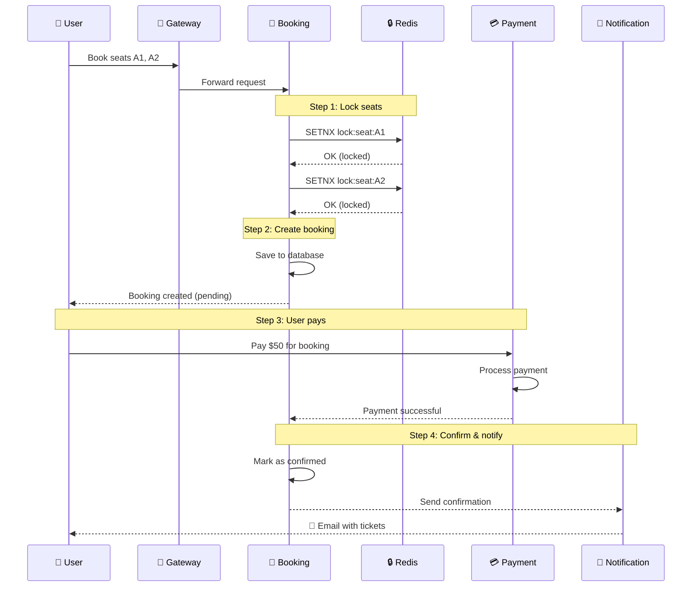

# 🎬 Movie Booking Distributed System

<div align="center">

[](https://github.com/your-org/movie-booking/actions)
[](https://opensource.org/licenses/MIT)
[](https://www.python.org/)
[](https://fastapi.tiangolo.com/)
[](https://www.docker.com/)
[](https://kubernetes.io/)

**A production-grade distributed movie ticket booking system**

_Microservices • Event-Driven • Distributed Locking • Observability_

[Quick Start](#-quick-start) • [Architecture](#-architecture-overview) • [API Reference](#-api-reference) • [Documentation](#-documentation)

</div>

---

## 📋 Project Information

| Field            | Value                                        |
| ---------------- | -------------------------------------------- |
| **Course Code**  | CSE702063                                    |
| **Course Name**  | Distributed Applications (Ứng dụng Phân tán) |
| **Group**        | N01 - Group 9                                |
| **Semester**     | 1-2-25                                       |
| **Version**      | 2.0                                          |
| **Last Updated** | January 2026                                 |

---

## 🎯 What is This Project?

This project demonstrates how to build a **real-world distributed application** for booking movie tickets. Think of it like a simplified version of CGV, Lotte Cinema, or AMC's online booking system.

### What Can Users Do?

```
┌─────────────────────────────────────────────────────────────────────────────┐
│                           USER JOURNEY                                      │
├─────────────────────────────────────────────────────────────────────────────┤
│                                                                             │
│   1. 🔐 REGISTER/LOGIN                                                      │
│      ↓                                                                      │
│   2. 🎬 BROWSE MOVIES        → View what's playing, read descriptions      │
│      ↓                                                                      │
│   3. 📅 SELECT SHOWTIME      → Choose date, time, and theater              │
│      ↓                                                                      │
│   4. 💺 PICK SEATS           → Visual seat selection (no double-booking!)  │
│      ↓                                                                      │
│   5. 💳 PAY                  → Secure payment with retry protection        │
│      ↓                                                                      │
│   6. 📧 RECEIVE TICKETS      → Email confirmation with booking details     │
│                                                                             │
└─────────────────────────────────────────────────────────────────────────────┘
```

### Why is it "Distributed"?

Instead of one big application, this system is split into **5 independent services** that work together:

| Service                  | Responsibility           | Why Separate?                  |
| ------------------------ | ------------------------ | ------------------------------ |
| **Auth Service**         | User login, registration | Security isolation             |
| **Movie Service**        | Movie catalog, showtimes | Can scale for read-heavy loads |
| **Booking Service**      | Seat reservation         | Handles complex locking logic  |
| **Payment Service**      | Payment processing       | PCI compliance isolation       |
| **Notification Service** | Email/SMS sending        | Async, doesn't block user      |

---

## 📚 Documentation

### For Everyone

| Document                                  | What You'll Learn                          |
| ----------------------------------------- | ------------------------------------------ |
| 📖 **[README.md](README.md)** (This file) | Project overview, quick start, basic usage |
| 📊 **[ARCHITECTURE.md](ARCHITECTURE.md)** | How the system is designed (with diagrams) |

### For Developers

| Document                                            | What You'll Learn                          |
| --------------------------------------------------- | ------------------------------------------ |
| 🛠️ **[SYSTEM_DESIGN.md](SYSTEM_DESIGN.md)**         | Design decisions, why we chose X over Y    |
| 🏗️ **[CODE_ARCHITECTURE.md](CODE_ARCHITECTURE.md)** | Internal code structure, refactoring guide |
| 📖 **[GLOSSARY.md](GLOSSARY.md)**                   | Technical terms explained                  |

### For DevOps/Operations

| Document                                      | What You'll Learn                       |
| --------------------------------------------- | --------------------------------------- |
| 🚀 **[OPERATIONS.md](OPERATIONS.md)**         | Deployment, monitoring, troubleshooting |
| 🔐 **[SECURITY.md](SECURITY.md)**             | Security architecture, best practices   |
| ☸️ **[INFRASTRUCTURE.md](INFRASTRUCTURE.md)** | Kubernetes, CI/CD, autoscaling          |

### For Deep-Dive Analysis

| Document                                                    | What You'll Learn                       |
| ----------------------------------------------------------- | --------------------------------------- |
| 🔍 **[ARCHITECTURE_ANALYSIS.md](ARCHITECTURE_ANALYSIS.md)** | Current vs target state, migration plan |

---

## 🚀 Quick Start

### Prerequisites

You only need **two things** installed:

| Requirement        | Why Needed                      | Installation                                               |
| ------------------ | ------------------------------- | ---------------------------------------------------------- |
| **Docker Desktop** | Runs all services in containers | [Download](https://www.docker.com/products/docker-desktop) |
| **Git**            | Clone the repository            | [Download](https://git-scm.com/downloads)                  |

### Step 1: Clone and Start

```bash
# Clone the repository
git clone <repository-url>
cd UDPT_CSE702063-1-2-25_N01_Group_9

# Start all services using the run script
# Linux/Mac:
./scripts/run_local.sh up

# Windows PowerShell:
.\scripts\run_local.ps1 up

# Or use docker-compose directly (takes 2-3 minutes the first time)
docker-compose up -d --build

# Check that everything is running
docker-compose ps
```

**Expected output:**

```
NAME                 STATUS              PORTS
auth-service         Up (healthy)        8001
movie-service        Up (healthy)        8002
booking-service      Up (healthy)        8003
payment-service      Up (healthy)        8004
notification-service Up (healthy)        8005
postgres             Up (healthy)        5432
redis                Up (healthy)        6379
rabbitmq             Up (healthy)        5672, 15672
nginx                Up                  80, 443
grafana              Up                  3000
prometheus           Up                  9090
```

### Step 2: Verify Installation

```bash
# Quick health check
curl http://localhost/health

# Expected response:
# {"status": "healthy", "services": 5}
```

### Step 3: Run End-to-End Tests

**Option A: Run the automated test script**

```bash
# Linux/Mac:
./scripts/e2e_test.sh

# Windows PowerShell:
.\scripts\e2e_test.ps1

# Or use the legacy test script:
# Linux/Mac: ./test_api.sh
# Windows: .\test_api.ps1
```

**Option B: Manual testing with cURL**

```bash
# 1. Register a new user
curl -X POST http://localhost/api/auth/register \
  -H "Content-Type: application/json" \
  -d '{
    "email": "john@example.com",
    "username": "johndoe",
    "password": "SecurePass123!"
  }'

# 2. Login to get your token
curl -X POST http://localhost/api/auth/token \
  -d "username=johndoe&password=SecurePass123!"

# Response includes: {"access_token": "eyJ...", ...}
# Copy the access_token for the next steps

# 3. Browse available movies
curl http://localhost/api/movies/movies

# 4. Get showtimes for a movie (replace with actual movie_id)
curl "http://localhost/api/movies/showtimes?movie_id=<movie-uuid>"

# 5. Book seats (replace TOKEN and IDs with actual values)
curl -X POST http://localhost/api/bookings/book \
  -H "Authorization: Bearer <your-access-token>" \
  -H "Content-Type: application/json" \
  -d '{
    "showtime_id": "<showtime-uuid>",
    "seat_ids": ["A1", "A2"]
  }'
```

---

## 🏗️ Architecture Overview

### High-Level View

```
┌─────────────────────────────────────────────────────────────────────────────┐
│                              USERS                                          │
│                    (Web Browser / Mobile App / API)                         │
└─────────────────────────────────────────────────────────────────────────────┘
                                    │
                                    │ HTTPS
                                    ▼
┌─────────────────────────────────────────────────────────────────────────────┐
│                         API GATEWAY (NGINX)                                 │
│                                                                             │
│    • Routes requests to correct service                                    │
│    • Rate limiting (prevents abuse)                                        │
│    • SSL/TLS encryption                                                    │
└─────────────────────────────────────────────────────────────────────────────┘
                                    │
        ┌───────────────────────────┼───────────────────────────┐
        │               │           │           │               │
        ▼               ▼           ▼           ▼               ▼
┌─────────────┐ ┌─────────────┐ ┌─────────────┐ ┌─────────────┐ ┌─────────────┐
│    Auth     │ │    Movie    │ │   Booking   │ │   Payment   │ │Notification │
│   Service   │ │   Service   │ │   Service   │ │   Service   │ │   Service   │
│             │ │             │ │             │ │             │ │             │
│ • Login     │ │ • Movies    │ │ • Reserve   │ │ • Charge    │ │ • Email     │
│ • Register  │ │ • Showtimes │ │ • Cancel    │ │ • Refund    │ │ • SMS       │
│ • JWT Token │ │ • Theaters  │ │ • Lock Seat │ │ • History   │ │ • Push      │
└──────┬──────┘ └──────┬──────┘ └──────┬──────┘ └──────┬──────┘ └──────┬──────┘
       │               │               │               │               │
       └───────────────┴───────┬───────┴───────────────┴───────────────┘
                               │
        ┌──────────────────────┼──────────────────────┐
        │                      │                      │
        ▼                      ▼                      ▼
┌─────────────────┐   ┌─────────────────┐   ┌─────────────────┐
│   PostgreSQL    │   │     Redis       │   │    RabbitMQ     │
│   (Database)    │   │    (Cache)      │   │   (Messages)    │
│                 │   │                 │   │                 │
│ • User data     │   │ • Seat locks    │   │ • booking.created│
│ • Movies        │   │ • Session cache │   │ • payment.done  │
│ • Bookings      │   │ • Rate limits   │   │ • send.email    │
│ • Payments      │   │                 │   │                 │
└─────────────────┘   └─────────────────┘   └─────────────────┘
```

### How Booking Works (Sequence)



### Key Distributed Patterns Used

| Pattern              | Problem Solved                    | Our Implementation             |
| -------------------- | --------------------------------- | ------------------------------ |
| **Distributed Lock** | Two users booking same seat       | Redis `SETNX` with TTL         |
| **Event-Driven**     | Services need to react to changes | RabbitMQ publish/subscribe     |
| **Saga Pattern**     | Multi-step transactions           | Choreography with compensation |
| **Circuit Breaker**  | One service failure crashes all   | Custom implementation          |
| **Idempotency**      | User clicks "pay" twice           | Idempotency keys in Redis      |

---

## 🔧 Technology Stack

### Application Layer

| Component      | Technology     | Purpose                              |
| -------------- | -------------- | ------------------------------------ |
| **Language**   | Python 3.11    | Main programming language            |
| **Framework**  | FastAPI        | High-performance async API framework |
| **ORM**        | SQLAlchemy 2.0 | Database abstraction                 |
| **Validation** | Pydantic 2.0   | Request/response validation          |
| **Server**     | Uvicorn        | ASGI server                          |

### Data Layer

| Component         | Technology    | Purpose                    |
| ----------------- | ------------- | -------------------------- |
| **Database**      | PostgreSQL 15 | Primary data storage       |
| **Cache**         | Redis 7       | Caching, distributed locks |
| **Message Queue** | RabbitMQ 3.12 | Event-driven communication |

### Infrastructure

| Component         | Technology           | Purpose                     |
| ----------------- | -------------------- | --------------------------- |
| **Containers**    | Docker               | Service packaging           |
| **Orchestration** | Kubernetes           | Production deployment       |
| **API Gateway**   | NGINX                | Routing, rate limiting, TLS |
| **Monitoring**    | Prometheus + Grafana | Metrics and dashboards      |
| **Tracing**       | Jaeger               | Distributed request tracing |

---

## 📂 Project Structure

```
📁 UDPT_CSE702063-1-2-25_N01_Group_9/
│
├── 📁 services/                    # 🎯 Microservices (the core code)
│   ├── 📁 auth-service/           # User authentication
│   │   ├── 📁 app/
│   │   │   ├── main.py            # FastAPI application
│   │   │   └── __init__.py
│   │   ├── Dockerfile             # Container definition
│   │   └── requirements.txt       # Python dependencies
│   │
│   ├── 📁 movie-service/          # Movie catalog
│   ├── 📁 booking-service/        # Seat reservation
│   ├── 📁 payment-service/        # Payment processing
│   └── 📁 notification-service/   # Notifications
│
├── 📁 database/                    # Database setup
│   └── init.sql                   # Schema + seed data
│
├── 📁 gateway/                     # API Gateway
│   └── nginx.conf                 # NGINX configuration
│
├── 📁 monitoring/                  # Observability
│   ├── prometheus.yml             # Metrics collection
│   ├── grafana-dashboard.json     # Dashboard definitions
│   └── grafana-datasources.yml    # Data sources
│
├── 📁 frontend/                    # Web UI
│   ├── Dockerfile
│   └── composer.json
│
├── 📁 docs/                        # Additional docs
│   └── 📁 diagrams/               # Architecture diagrams
│
├── 📄 docker-compose.yml          # Local development setup
├── 📄 test_api.sh                 # Test script (Linux/Mac)
├── 📄 test_api.ps1                # Test script (Windows)
│
├── 📖 README.md                   # 👈 You are here
├── 📖 ARCHITECTURE.md             # System architecture
├── 📖 SYSTEM_DESIGN.md            # Design decisions
├── 📖 OPERATIONS.md               # Operations guide
├── 📖 SECURITY.md                 # Security guide
├── 📖 GLOSSARY.md                 # Technical terms
├── 📖 CODE_ARCHITECTURE.md        # Internal code structure
└── 📖 INFRASTRUCTURE.md           # Kubernetes, CI/CD
```

---

## 🌐 Service Endpoints

### Access URLs (Development)

| Service                  | URL                        | Purpose          |
| ------------------------ | -------------------------- | ---------------- |
| **API Gateway**          | http://localhost           | Main entry point |
| **Auth Service**         | http://localhost:8001/docs | Swagger UI       |
| **Movie Service**        | http://localhost:8002/docs | Swagger UI       |
| **Booking Service**      | http://localhost:8003/docs | Swagger UI       |
| **Payment Service**      | http://localhost:8004/docs | Swagger UI       |
| **Notification Service** | http://localhost:8005/docs | Swagger UI       |
| **RabbitMQ Management**  | http://localhost:15672     | Message queue UI |
| **Grafana**              | http://localhost:3000      | Dashboards       |
| **Prometheus**           | http://localhost:9090      | Metrics          |

### Default Credentials

| Service    | Username | Password |
| ---------- | -------- | -------- |
| PostgreSQL | admin    | admin123 |
| RabbitMQ   | admin    | admin123 |
| Grafana    | admin    | admin123 |
| Redis      | -        | redis123 |

> ⚠️ **Important**: Change all passwords before production deployment!

---

## 📡 API Reference

### Authentication (`/api/auth`)

| Method | Endpoint                 | Description          | Auth Required |
| ------ | ------------------------ | -------------------- | ------------- |
| `POST` | `/register`              | Create new account   | ❌ No         |
| `POST` | `/token`                 | Login, get JWT token | ❌ No         |
| `GET`  | `/verify`                | Check if token valid | ✅ Yes        |
| `POST` | `/logout`                | Invalidate token     | ✅ Yes        |
| `GET`  | `/.well-known/jwks.json` | Public keys for JWT  | ❌ No         |

**Example: Register**

```bash
curl -X POST http://localhost/api/auth/register \
  -H "Content-Type: application/json" \
  -d '{
    "email": "user@example.com",
    "username": "moviefan",
    "password": "SecurePass123!"
  }'
```

### Movies (`/api/movies`)

| Method | Endpoint                | Description       | Auth Required |
| ------ | ----------------------- | ----------------- | ------------- |
| `GET`  | `/movies`               | List all movies   | ❌ No         |
| `GET`  | `/movies/{id}`          | Get movie details | ❌ No         |
| `GET`  | `/theaters`             | List theaters     | ❌ No         |
| `GET`  | `/showtimes`            | List showtimes    | ❌ No         |
| `GET`  | `/showtimes/{id}/seats` | Seat availability | ❌ No         |
| `POST` | `/movies`               | Create movie      | ✅ Admin      |

**Example: Browse movies**

```bash
curl http://localhost/api/movies/movies | jq
```

### Bookings (`/api/bookings`)

| Method | Endpoint                | Description      | Auth Required |
| ------ | ----------------------- | ---------------- | ------------- |
| `POST` | `/book`                 | Create booking   | ✅ Yes        |
| `GET`  | `/bookings`             | List my bookings | ✅ Yes        |
| `GET`  | `/bookings/{id}`        | Booking details  | ✅ Yes        |
| `POST` | `/bookings/{id}/cancel` | Cancel booking   | ✅ Yes        |

**Example: Book seats**

```bash
curl -X POST http://localhost/api/bookings/book \
  -H "Authorization: Bearer $TOKEN" \
  -H "Content-Type: application/json" \
  -d '{
    "showtime_id": "abc-123",
    "seat_ids": ["A1", "A2"]
  }'
```

### Payments (`/api/payments`)

| Method | Endpoint                | Description     | Auth Required |
| ------ | ----------------------- | --------------- | ------------- |
| `POST` | `/process`              | Process payment | ✅ Yes        |
| `GET`  | `/payments`             | Payment history | ✅ Yes        |
| `GET`  | `/payments/{id}`        | Payment details | ✅ Yes        |
| `POST` | `/payments/{id}/refund` | Request refund  | ✅ Yes        |

---

## 🧪 Testing

### Automated API Tests

```bash
# Linux/Mac
chmod +x test_api.sh
./test_api.sh

# Windows PowerShell
.\test_api.ps1
```

The test script will:

1. ✅ Register a test user
2. ✅ Login and get token
3. ✅ Browse movies
4. ✅ Create a booking
5. ✅ Process payment
6. ✅ Check notifications

### Manual Health Checks

```bash
# Check all services
curl http://localhost/health

# Check individual service
curl http://localhost:8001/health  # Auth
curl http://localhost:8002/health  # Movie
curl http://localhost:8003/health  # Booking
curl http://localhost:8004/health  # Payment
curl http://localhost:8005/health  # Notification
```

---

## 🚢 Deployment

### Development (Docker Compose)

```bash
# Start
docker-compose up -d --build

# View logs
docker-compose logs -f booking-service

# Stop
docker-compose down

# Clean everything (including data)
docker-compose down -v
```

### Production (Kubernetes)

See [INFRASTRUCTURE.md](INFRASTRUCTURE.md) for complete Kubernetes deployment guide including:

- Helm charts
- HPA (auto-scaling)
- Secrets management
- CI/CD pipelines

---

## ✨ Key Features Demonstrated

### 1. Distributed Locking (Preventing Double-Booking)

```python
# Redis SETNX ensures only one user can lock a seat
lock_key = f"lock:seat:{showtime_id}:{seat_id}"
acquired = await redis.set(lock_key, booking_id, nx=True, ex=300)

if not acquired:
    raise SeatAlreadyBookedError("Seat is taken!")
```

### 2. Event-Driven Architecture

```python
# When payment completes, an event is published
await rabbitmq.publish(
    exchange="booking_events",
    routing_key="payment.completed",
    message={
        "booking_id": booking_id,
        "amount": 50.00,
        "timestamp": datetime.utcnow()
    }
)

# Notification service listens and reacts
@consumer("payment.completed")
async def send_confirmation_email(event):
    await email.send(event["user_email"], "Your tickets are ready!")
```

### 3. Circuit Breaker (Fault Tolerance)

```
Normal state:    CLOSED  ──────────────────────────────────>
                            │ 5 failures in 60 seconds
                            ▼
Protect system:  OPEN    ◄───────────────────────────────────
                            │ 30 second timeout
                            ▼
Test recovery:   HALF-OPEN ──► Success ──► CLOSED
                            │
                            └─► Failure ──► OPEN
```

### 4. Idempotency (Safe Payment Retries)

```python
# User accidentally clicks "Pay" twice
# Idempotency key ensures only one charge

idempotency_key = f"payment:{booking_id}"

if await redis.exists(idempotency_key):
    return existing_payment  # Return same result, don't charge again

# Process payment...
await redis.set(idempotency_key, payment_id, ex=86400)  # 24h TTL
```

---

## 🤝 Contributing

1. **Fork** the repository
2. **Create** a feature branch: `git checkout -b feature/amazing-feature`
3. **Commit** your changes: `git commit -m 'Add amazing feature'`
4. **Push** to the branch: `git push origin feature/amazing-feature`
5. **Open** a Pull Request

---

## 📝 License

This project is licensed under the **MIT License** - see the [LICENSE](LICENSE) file for details.

---

## 👥 Team

**CSE702063 - Distributed Applications**  
**N01 - Group 9**  
**Semester 1-2-25**

---

<div align="center">

**Movie Booking Distributed System v2.0**  
_Built with ❤️ for learning distributed systems_  
_January 2026_

</div>
